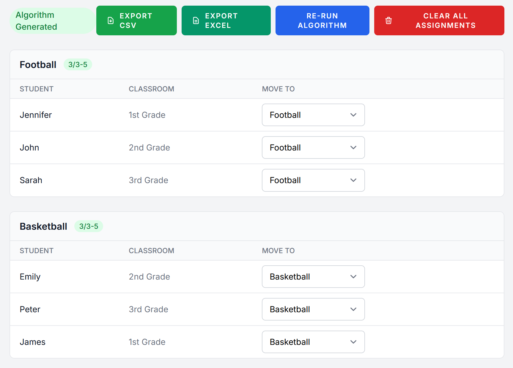

# Smarter Groups

**Sort students into workshop groups in seconds — respecting their preferences, your capacity limits, and a fair classroom mix.**

**Live app:** [smarter-groups.com](http://smarter-groups.com)

Assigning a few hundred students to workshop groups by hand is slow and thankless: everyone has preferences, every group has a minimum and a maximum, and you don't want all of room 3B landing in the same activity. Smarter Groups does the tedious first pass for you — it produces a solid, constraint-aware assignment that you can then fine-tune by dragging students around. It's built for teachers and workshop organizers, not data scientists.



---

## How it works

Five steps, start to finish:

1. **Set up a workshop** — add groups (each with a min/max size and a priority), your classrooms, and your students.
2. **Or import in bulk** — drop in a single CSV of students and their group preferences instead of typing them in.
3. **Run the algorithm** — one click produces a balanced draft assignment that honors preferences and capacity.
4. **Refine by hand** — drag and drop any student between groups; the app flags groups that fall below their minimum.
5. **Export** — download the final assignment as CSV or Excel.

## Features

| Feature | What it does |
|---|---|
| **Workshop management** | Run multiple workshops, each with its own groups, classrooms, and students |
| **Smart assignment** | Priority-based algorithm that fills important groups first and balances the rest ([how it works](docs/algorithm.md)) |
| **Capacity & balance rules** | Per-group min/max sizes, plus an optional cap on students from the same classroom |
| **CSV import** | Bulk-load students, classrooms, and preferences from one file |
| **Manual override** | Drag-and-drop to adjust any assignment after a run |
| **Export** | Download results as CSV or Excel |
| **Multi-user** | Every account manages its own private workshops |

## The assignment algorithm

The core of the app is a priority-based greedy algorithm tuned to produce a "good enough" starting point a teacher can refine — not a perfect global optimum:

1. **Groups are sorted by priority** (lower number = filled first).
2. **More constrained students go first** — those with fewer viable options are placed before students with lots of choices.
3. **Each student takes their highest available preference**, checked against capacity and classroom-mix limits.
4. **Priority adapts as groups fill** — once a group reaches its minimum, it steps aside so under-filled groups can catch up, while more popular groups still keep an edge.

The result fills under-resourced groups first, then tops up the popular ones. Full walkthrough and edge cases: **[docs/algorithm.md](docs/algorithm.md)**.

## Quick start

> Requires **PHP 8.4+**, **Composer**, **Node.js & npm**, and **MySQL**.

```bash
git clone <repository-url> && cd smarter-groups
composer install
npm install
cp .env.example .env
php artisan key:generate
```

Point `.env` at your database:

```env
DB_CONNECTION=mysql
DB_HOST=127.0.0.1
DB_PORT=3306
DB_DATABASE=smarter_groups
DB_USERNAME=your_username
DB_PASSWORD=your_password
```

Then migrate, seed demo data, and build the frontend:

```bash
php artisan migrate --seed
npm run build
```

Start the dev server with `php artisan serve` (run `npm run dev` in a second terminal for hot reloading) and open **http://localhost:8000**.

The `--seed` flag creates a demo account and two pre-populated workshops to explore:

| Email | Password |
|---|---|
| `testUser@example.com` | `test123` |

## Using the CSV import

Import students with a **semicolon-separated** CSV. Put a `1` in a group's column to mark it as one of that student's preferences:

```
Classroom;Student Name;Group A;Group B;Group C
Class 1;John Doe;1;;1
Class 1;Jane Smith;;1;
Class 2;Bob Wilson;1;1;
```

- **Column 1** — classroom name
- **Column 2** — student name
- **Columns 3+** — one column per group; a `1` means "this student prefers this group"

Groups and classrooms named in the file are created automatically on import.

## Tech stack

| Layer | Tech |
|---|---|
| Backend | PHP 8.4, Laravel 11 |
| Frontend | Blade, Tailwind CSS 3, Alpine.js (built with Vite) |
| Database | MySQL |
| Auth | Laravel Breeze |
| Testing | Pest |
| Exports | maatwebsite/excel |
| Deployment | Docker, hosted via Coolify on a VPS |

## Documentation

Deeper docs live in [`docs/`](docs/):

- **[algorithm.md](docs/algorithm.md)** — how assignment works, phase by phase
- **[architecture.md](docs/architecture.md)** — code structure and data model
- **[deployment.md](docs/deployment.md)** — how the live site is built and hosted
- **[style_guide.md](docs/style_guide.md)** — UI and code conventions

## Development

```bash
# Reset the database and reload demo data
php artisan migrate:fresh --seed

# Format code
vendor/bin/pint

# Run the test suite (clear config first so test env applies)
php artisan config:clear && php artisan test

# Run a focused group or test
php artisan test --group=algorithm
php artisan test --filter="simple perfect fit"
```
